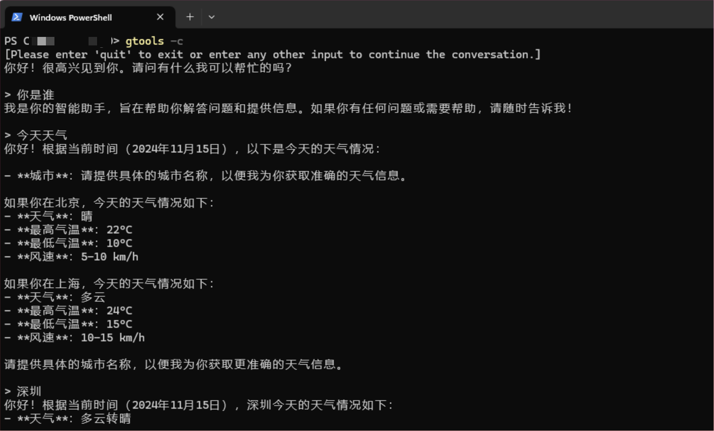

### X Command
xc(x command)，为你的terminal（终端）插上翅膀~

### 1. 简单使用
1. 准备好golang环境，go bin放到环境变量下
2. 执行安装命令
```shell
# 安装到go bin目录
go install github.com/anjude/xc@lastest

# 执行智能对话
xc -c "你好"

# 查看帮助
xc -h
```



### 2. 开发
```azure
# 详细教程：https://xie.infoq.cn/article/915006cf3760c99ad0028d895

#增加命令
go install github.com/spf13/cobra-cli@latest
cobra-cli add -c
go run .\main.go chat
```

### 3. 联系作者
公众号：豆小匠Coding

